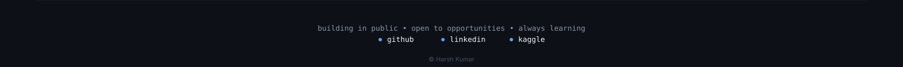

  

 

### 🔧 Currently Building

  

<strong>View architecture</strong>

 

  

 

### ⚙️ Stack

  

 

### 📦 Projects

| Project | Description | Stack |
|---|---|---|
| **Tenhours** | E-commerce platform | MERN |
| **Child Vaccination Tracking System** | Tracks and manages child vaccination schedules | MERN |

<strong>Paused — FinAgent (KPI extraction, multi-agent system)</strong>

 
Multi-agent system for extracting and validating financial KPIs from unstructured PDF filings using LLMs and semantic search. Currently paused — not actively in development.

 

### 📡 Currently Learning / Competing

  

 

### 📊 GitHub Stats

<table align="center">
<tr>
<td></td>
<td></td>
</tr>
</table>

 

  

