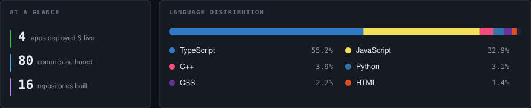
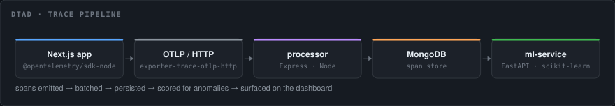
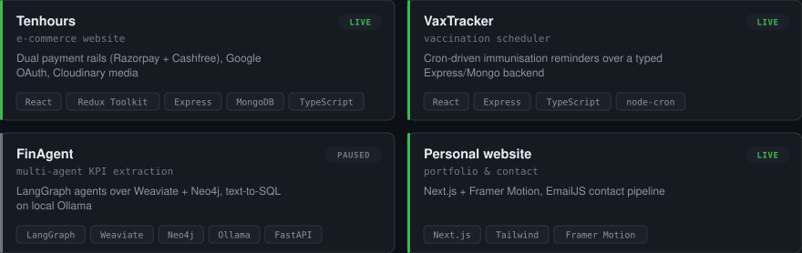
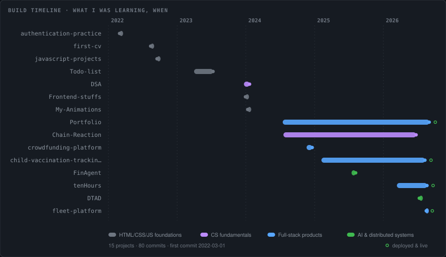
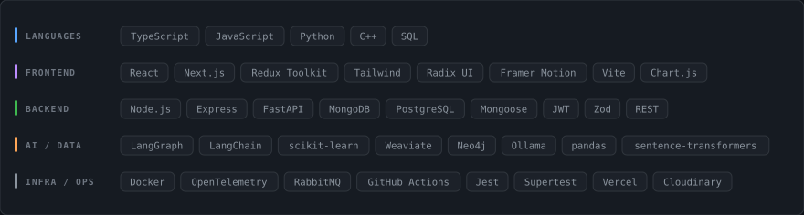

<!--
  This README is generated. Panels are rendered from live GitHub data by
  tools/fetch_data.py + tools/render.py and refreshed weekly by
  .github/workflows/dashboard.yml. Edit the generators, not the SVGs.
-->

<picture>
  <source media="(prefers-color-scheme: dark)" srcset="./assets/header-dark.svg">
  <source media="(prefers-color-scheme: light)" srcset="./assets/header-light.svg">
  
</picture>

<picture>
  <source media="(prefers-color-scheme: dark)" srcset="./assets/overview-dark.svg">
  <source media="(prefers-color-scheme: light)" srcset="./assets/overview-light.svg">
  
</picture>

## Currently building

**[Distributed Trace Anomaly Detector](https://github.com/harshkrt/DTAD)** — instrument a real
Next.js app with OpenTelemetry, ship spans over OTLP to a Node processor, persist them, and
score them for anomalies with a FastAPI + scikit-learn service.

<picture>
  <source media="(prefers-color-scheme: dark)" srcset="./assets/arch-dark.svg">
  <source media="(prefers-color-scheme: light)" srcset="./assets/arch-light.svg">
  
</picture>

<strong>Why I'm building it</strong>

 

Most side projects stop at "it works on my machine." I wanted to find out what happens
*after* that — how you know a service is misbehaving before a user tells you.

- **Instrumentation is the hard part, not the model.** Getting clean, correlated spans out
  of a Next.js app took longer than training the detector.
- **Anomalies are contextual.** A 400 ms span is fine on a cold start and alarming on a
  cached read, so the scorer works on distributions, not absolute thresholds.
- **Three languages, one trace ID.** Keeping context propagated across a TS frontend, a Node
  processor, and a Python scorer is where most of the design effort went.

## Selected work

<picture>
  <source media="(prefers-color-scheme: dark)" srcset="./assets/projects-dark.svg">
  <source media="(prefers-color-scheme: light)" srcset="./assets/projects-light.svg">
  
</picture>

|  | Project | What's interesting | |
|:--|:--|:--|:--|
| 🟠 | **[DTAD](https://github.com/harshkrt/DTAD)** | End-to-end OpenTelemetry pipeline with an ML scorer | |
| 🟢 | **[tenHours](https://github.com/harshkrt/tenHours)** | Two payment gateways, Google OAuth, Cloudinary media | [live ↗](https://tenhours.vercel.app) |
| 🟢 | **[Vaccination tracker](https://github.com/harshkrt/child-vaccination-tracking-system)** | Cron-scheduled immunisation reminders, typed end to end | [live ↗](https://child-vaccination-tracking-system.vercel.app) |
| 🟢 | **[fleet-platform](https://github.com/harshkrt/fleet-platform)** | Zod-validated API with a Jest + Supertest suite | [live ↗](https://fleet-platform-weld.vercel.app) |
| ⚪ | **[FinAgent](https://github.com/harshkrt/FinAgent)** | LangGraph agents over Weaviate + Neo4j, text-to-SQL on Ollama | |
| 🟢 | **[Portfolio](https://github.com/harshkrt/Portfolio)** | Next.js + Framer Motion | [live ↗](https://portfolio-umber-iota-13.vercel.app) |

## Trajectory

<picture>
  <source media="(prefers-color-scheme: dark)" srcset="./assets/timeline-dark.svg">
  <source media="(prefers-color-scheme: light)" srcset="./assets/timeline-light.svg">
  
</picture>

## Stack

<picture>
  <source media="(prefers-color-scheme: dark)" srcset="./assets/stack-dark.svg">
  <source media="(prefers-color-scheme: light)" srcset="./assets/stack-light.svg">
  
</picture>

Every item above is in active use in one of the repositories linked here — no aspirational logos.

---

  <a href="https://linkedin.com/in/harshk48">LinkedIn</a> ·
  <a href="https://x.com/harshk_t">Twitter</a> ·
  <a href="https://harsh-kumar.hashnode.dev">Writing</a> ·
  <a href="https://leetcode.com/harshk48">LeetCode</a> ·
  <a href="mailto:hktg480@gmail.com">Email</a>
    
  Open to backend, full-stack and platform roles.

