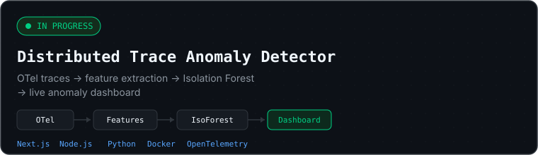
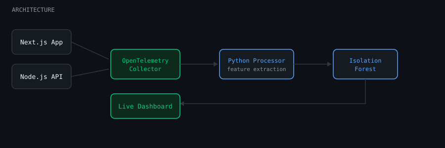
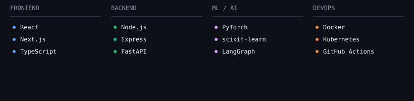
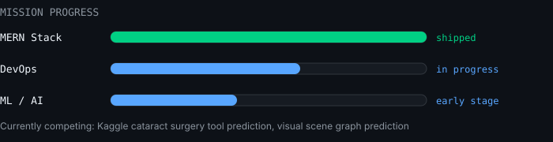

  
   
  

 

### Currently Building

  

<strong>View architecture</strong>

 

  

 

### Stack

  

 

### Projects

| Project | Description | Stack |
|---|---|---|
| **Tenhours** | E-commerce platform | MERN |
| **Child Vaccination Tracking System** | Tracks and manages child vaccination schedules | MERN |

<strong>Paused — FinAgent (KPI extraction, multi-agent system)</strong>

 
Multi-agent system for extracting and validating financial KPIs from unstructured PDF filings using LLMs and semantic search. Currently paused — not actively in development.

 

### Currently Learning / Competing

  

 

<!--START_SECTION:activity-->
<!--END_SECTION:activity-->
### GitHub Stats

<table align="center">
<tr>
<td></td>
<td></td>
</tr>
</table>

 

---

**building in public** • **open to opportunities** • **always learning**

<a href="https://x.com/harshk_t">Twitter</a> •
<a href="https://linkedin.com/in/harshk48">LinkedIn</a> •
<a href="https://harsh-kumar.hashnode.dev">HashNode</a> •
<a href="https://leetcode.com/harshk48">LeetCode</a> •
© Harsh Kumar

